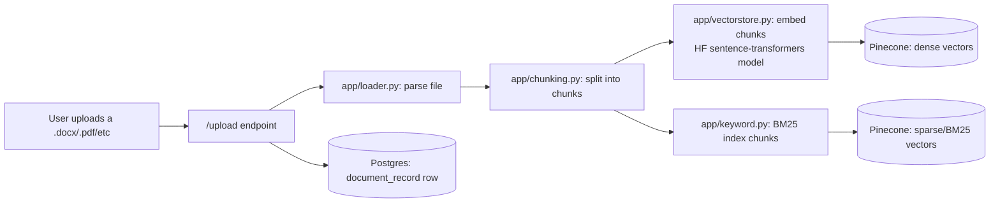
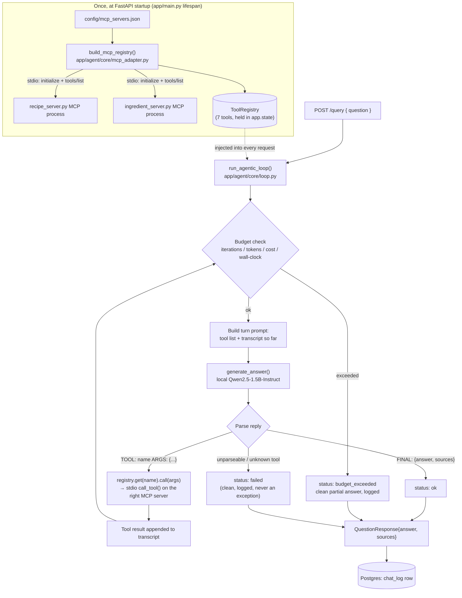
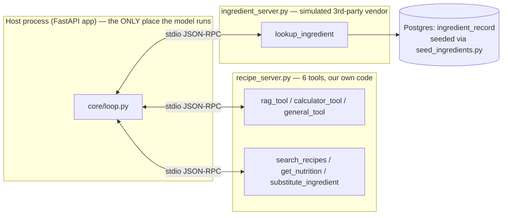
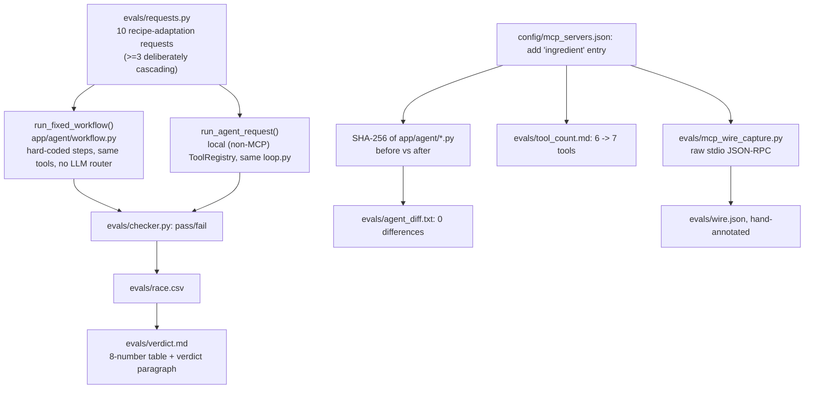

# Cookbook RAG + Agent — High-Level Architecture & Workflow

This document explains how the application actually works end to end: ingestion, the live
`/query` request path, the MCP tool layer behind it, and where the Week 7/9 evaluation
harness fits in. Diagrams are Mermaid — they render natively on GitHub and most Markdown
viewers.

---

## 1. The two data stores

| Store | Holds | Used by |
|---|---|---|
| **Pinecone** (dense + sparse/BM25 vectors) | Chunked cookbook text | `app/vectorstore.py`, `app/keyword.py`, `app/retrieval.py` |
| **Postgres** | `chat_log`, `document_record` (app data) + `ingredient_record` (the simulated third-party ingredient DB) | `app/database.py`, `app/mcp_servers/ingredient_db_data.py` |

The ingredient table is a deliberate exception: it's seeded and owned by `app/mcp_servers/`
(the "vendor" side of the W9 scenario), not by `app/database.py`, even though it lives in the
same Postgres instance. See §5.

---

## 2. Document ingestion flow



`/ingest` does the same thing for every file already sitting in the local `documents/`
directory, in bulk.

---

## 3. The live `/query` request — full path

This is the important one. `/query` is no longer "retrieve chunks, ask the model" — it's a
genuine tool-calling agent. The LLM decides, turn by turn, which tool (if any) it needs.



**Key point:** `loop.py` only ever talks to a generic `ToolRegistry` (`app/agent/core/registry.py`).
It has zero knowledge of MCP, Pinecone, or any specific tool. Whether a tool call happens to be
`rag_tool` running RAG retrieval in-process or `lookup_ingredient` hitting Postgres through a
separate MCP server process is invisible to the loop — it just sees `{name, description,
call(args) -> dict}`. That's what makes adding a new MCP server a config-only change (§5).

---

## 4. What each tool actually does

All 7 tools are plain Python functions, wrapped as MCP tools by one of the two servers.

| Tool | Lives in | Backed by | Returns a final answer directly? |
|---|---|---|---|
| `rag_tool` | `recipe_server.py` (from `chat_tools.py`) | Pinecone hybrid search + `generate_answer` | Yes — `{answer, sources}` |
| `calculator_tool` | `recipe_server.py` (from `chat_tools.py`) | Safe `ast`-based arithmetic, no LLM | Yes |
| `general_tool` | `recipe_server.py` (from `chat_tools.py`) | `generate_answer`, no retrieval | Yes |
| `search_recipes` | `recipe_server.py` (from `recipe_tools.py`) | Pinecone hybrid search + JSON-extraction LLM call | No — structured recipe data, loop keeps going |
| `get_nutrition` | `recipe_server.py` (from `recipe_tools.py`) | Static table, `app/agent/tools/nutrition_data.py`, no LLM | No |
| `substitute_ingredient` | `recipe_server.py` (from `recipe_tools.py`) | Static table, `app/agent/tools/substitution_map.py`, no LLM | No |
| `lookup_ingredient` | `ingredient_server.py` | **Postgres** `ingredient_record` table (§5) | No |

When a tool already returns `{"answer": ..., "sources": [...]}` (the three chat tools), the loop
treats that as the final answer immediately — no extra turn spent asking the model to restate it.
The recipe-domain tools return structured intermediate data instead, so the loop keeps looping
(gather → gather → `FINAL:`) until it has enough to answer, or a budget trips.

---

## 5. The MCP layer — two servers, one config file



- **Neither MCP server file ever imports the LLM.** `generate_answer` is only called inside
  `core/loop.py`, in the host process — the servers are pure capability providers.
- **`ingredient_server.py` is deliberately isolated from `app/agent/`** — it doesn't import
  `recipe_tools.py` or anything else from the agent package, simulating code someone else wrote
  and shipped. It now reaches into the **same Postgres instance** the rest of the app uses (via
  `app.database.engine`), seeded by `python -m app.mcp_servers.seed_ingredients` — see
  `evals/risk_note.md` for why that's a real supply-chain consideration once a "vendor" server
  shares DB credentials with the host app, not just an academic one.
- **Adding server two was a config-only change.** `config/mcp_servers.json` went from one
  `servers` entry to two; `git diff`/checksums on every file under `app/agent/` show zero
  changes, because `mcp_adapter.py` discovers tools generically from whatever `tools/list`
  returns — see `evals/agent_diff.txt` and `evals/tool_count.md` (6 tools → 7 tools) for the
  actual proof.

---

## 6. Budgets — how a runaway request terminates cleanly

`app/agent/core/budgets.py` tracks four things every single loop iteration, not just once:

- **max_iterations** — how many tool-call turns the loop has taken
- **max_tokens** — cumulative prompt + completion tokens across *every* turn (not just the last)
- **max_cost_usd** — `tokens * nominal $/1k tokens` (the model is local/free — this is a
  reporting figure, not a real bill)
- **timeout_s** — wall-clock time since the request started

If any budget is exceeded, the loop returns `status: budget_exceeded` immediately — no
exception, no spinning — with whatever partial result it had, and logs one line naming which
budget fired. `/query` turns that into a plain "needed more steps than allowed" message for the
user. `evals/budget_demo.py` deliberately caps `max_iterations` below what a real request needs,
so it trips the same code path on every run.

---

## 7. The evaluation harness (Week 7 + Week 9 deliverables) — separate from the live app



This harness exercises the **same underlying tool functions** as the live app (`recipe_tools.py`,
`chat_tools.py`) but through its own entry points — it doesn't spin up the live FastAPI server or
go through real MCP subprocesses for the race (that would make a 10-request × 2-system race
prohibitively slow on a CPU-only local model). The W9-specific proof scripts
(`mcp_wire_capture.py`, the tool-count capture) do use the real MCP servers, since that's exactly
what's being proven there.

**Current status of this harness:** the fixed-workflow half of the race has real, complete
numbers (see `evals/verdict.md`); the agent half was interrupted by a memory-constrained host
mid-run and has not yet been completed on this machine — `verdict.md` states that plainly rather
than reporting fabricated numbers.

---

## 8. File map (quick reference)

```
cookbook-backend/
  app/
    main.py                 startup: build MCP tool registry once, store on app.state
    routes.py                /query -> run_agentic_loop(); /upload, /ingest, /documents, etc.
    rag.py                    generate_answer(), get_generator(), ingest_file/ingest_directory
    retrieval.py              hybrid_search(): Pinecone dense + BM25, RRF-fused, cross-encoder reranked
    prompt.py                 all prompt templates (RAG, general chat, recipe JSON extraction)
    database.py               ChatLog, DocumentRecord, Postgres engine
    agent/
      core/                   generic agent engine — registry.py, budgets.py, mcp_adapter.py, loop.py
      tools/                  chat_tools.py, recipe_tools.py, nutrition_data.py, substitution_map.py
      workflow.py             fixed-workflow twin (eval-only)
    mcp_servers/
      recipe_server.py        MCP server one: wraps all 6 of our own tools
      ingredient_server.py    MCP server two: simulated vendor, backed by Postgres
      ingredient_db_data.py   DB-backed lookup() for ingredient_server
      ingredient_db_models.py IngredientRecord SQLModel table
      seed_ingredients.py     python -m app.mcp_servers.seed_ingredients
  config/
    mcp_servers.json          the ONE file touched to add/remove an MCP server
  evals/                      W7 race + W9 proof artifacts (see §7)
```
